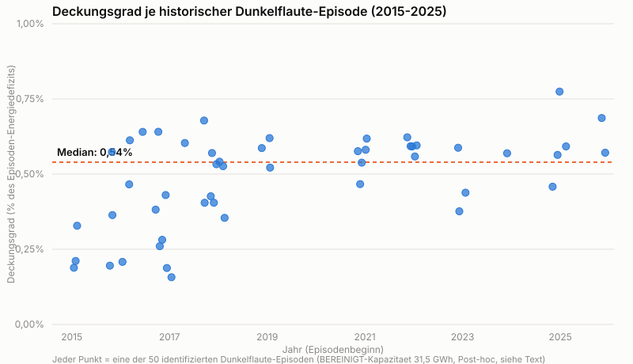

**ENTWURF – nicht veröffentlicht. Freigabe durch Daniel Saure erforderlich vor Publikation.**

---

# Batteriespeicher und Dunkelflauten: Was eine eigene Auswertung historischer Daten zeigt

## Einleitung

In der öffentlichen Debatte kursieren derzeit mehrere Einzelzahlen dazu, wie
viel deutsche Batteriespeicher zu "Dunkelflauten" beitragen können – also zu
mehrtägigen Phasen mit gleichzeitig wenig Wind- und Solarstrom. Die Zahlen
reichen von "2 % des Tagesverbrauchs" über "durchschnittlich 2,3 Stunden
Speicherdauer" bis zu einer Studie, die 300 GWh Speicherkapazität bis 2050
mit 1 % des dann erwarteten Bedarfs gleichsetzt. Auch ein aktueller
Zeitungsartikel nennt eine weitere Zahl: rechnerisch könnten Großbatterien
zusammen mit den privaten Heimspeichern rund drei Millionen
Zwei-Personen-Haushalte einen Tag lang versorgen. Diese Zahlen beruhen auf
unterschiedlichen Methoden, Zeiträumen und Fragestellungen und sind
untereinander nicht direkt vergleichbar.

Für dieses Projekt haben wir deshalb eine eigene, vorab festgelegte
(präregistrierte) Berechnung direkt aus amtlichen Rohdaten durchgeführt:
Aus den SMARD-Zeitreihen der Bundesnetzagentur wurden alle historischen
Dunkelflaute-Episoden seit 2015 identifiziert, das jeweilige Energiedefizit
berechnet und diesem Defizit die tatsächlich installierte
Batteriespeicherkapazität gegenübergestellt – unter realistischen Annahmen
zu Ladezustand und Wirkungsgrad, nicht zu 100 % sofort verfügbarer
Nennkapazität.

## Die Ergebnisse auf einen Blick

- **50 Dunkelflaute-Episoden** seit 2015 identifiziert, Energiedefizit im
  Median **4.301 GWh** pro Episode.
- Aktuell installierte Speicherkapazität hätte davon im Median nur rund
  **1 %** decken können (Post-hoc-Bereinigung der Rohdaten nötig, siehe
  unten) – über 50 Episoden hinweg durchgängig zwischen 0 % und rund 1 %,
  nie mehr.
- Für Ende 2026 (Sekundärquelle) ähnliche Größenordnung; für 2030 liefern
  amtliche Quellen **keine** mit unseren Szenarien vergleichbare Zahl –
  das berichten wir offen als eigenständiges Ergebnis, nicht als Lücke.
- Ergebnis ist über acht verschiedene Sensitivitätsanalysen hinweg stabil.

## Die Kernzahl

Zwischen Januar 2015 und Juli 2026 wurden **50 Dunkelflaute-Episoden**
identifiziert (mindestens drei aufeinanderfolgende Tage mit besonders
geringer Wind- und Solarerzeugung im Verhältnis zum Verbrauch). Das
kumulierte Energiedefizit dieser Episoden lag im Median bei **4.301 GWh**
(Interquartilsabstand 3.921–5.994 GWh; kleinste Episode rund 3.000 GWh,
größte rund 14.800 GWh).

Der aktuell installierten Batteriespeicherkapazität stellen wir dieses
Defizit direkt gegenüber. Hier gilt eine wichtige Einschränkung, die wir
nicht verstecken, sondern voranstellen:

> **Post-hoc-Bereinigung (nicht im ursprünglichen Analyseplan vorgesehen):**
> Die Rohdaten aus dem Marktstammdatenregister (MaStR) für die aktuelle
> Speicherkapazität enthielten ein Cluster offensichtlicher
> Dateneingabefehler: 50 von 2,72 Millionen erfassten Anlagen verursachten
> 97,25 % einer sonst 46-fach überhöhten Gesamtsumme (1.144,8 GWh – ein
> Wert, der bereits höher liegt als unabhängig berichtete Gesamtbestände und
> mit hoher Wahrscheinlichkeit nicht plausibel ist). Der hier berichtete Wert
> von **31,5 GWh** beruht auf einem nachträglich festgelegten
> Ausschlusskriterium (Einzelanlagen mit einem gemeldeten Kapazitätswert
> über 100 MWh wurden entfernt) – **nicht** auf der ursprünglich geplanten
> wörtlichen Berechnung. Diese Schwelle ist nicht technisch unabhängig
> begründet, sondern bewusst so gewählt, dass sie nahe an zwei unabhängigen
> Sekundärquellen liegt (Branchenverband BVES: 24 GWh; IWR-Prognose für
> Jahresende 2026: rund 35 GWh). Das ist ein offenes
> Confirmation-Bias-Risiko, das wir hier transparent machen, nicht
> verstecken. Diese Entscheidung wurde von Daniel Saure am 31.08.2026
> getroffen und dokumentiert.

Auf Basis dieser bereinigten Kapazität (31,5 GWh) hätte die aktuell
installierte Batteriespeicherkapazität im Median rund **1 % des
Episoden-Energiedefizits** decken können (gerundeter Wert gemäß
Berichtsstandard; der genauere Wert vor Rundung liegt bei rund 0,5 %,
Spannbreite über alle 50 Episoden 0–1 %). Für die für Ende 2026 erwartete
Kapazität (Sekundärquelle IWR, rund 35 GWh, ausdrücklich als Prognose und
nicht als amtliche Zahl gekennzeichnet) ergibt sich eine ähnliche
Größenordnung (Median rund 0,6 %, ungerundet).

Jeder Punkt in dieser Grafik ist eine der 50 identifizierten Episoden – das
Bild zeigt, warum die Median-Zahl kein Zufallstreffer ist: Über elf Jahre
und ganz unterschiedliche Wetterlagen hinweg bewegt sich der Deckungsgrad
durchgängig in einem schmalen Band zwischen 0 % und rund 0,8 %.

## Einordnung

Diese Größenordnung ist über zahlreiche Sensitivitätsanalysen hinweg
bemerkenswert stabil. Wir haben die Definition einer "Dunkelflaute" (10.
Perzentil der Wind+Solar-zu-Verbrauch-Relation, mindestens drei
zusammenhängende Tage) bewusst als methodische Festlegung mit
Ermessensspielraum behandelt, nicht als "objektive Wahrheit" – deshalb haben
wir sie systematisch variiert: mit einem großzügigeren Schwellenwert (20.
Perzentil), mit kürzerer oder längerer Mindestdauer (2 bzw. 5 Tage), mit
Verkettung kurz unterbrochener Episoden, mit einer breiteren Systemgrenze
(zusätzlich Biomasse und Wasserkraft), mit einer Leistungskappung anhand der
gemeldeten Anschlussleistung, mit anderen Anfangsladezuständen (50 % / 100 %
statt 80 %) und mit anderen Rundtrip-Wirkungsgraden (80 % / 90 % statt
85 %). In praktisch allen Varianten liegt der mediane Deckungsgrad zwischen
0 % und 1 %. Eine unabhängige Kreuzprüfung mit einem Branchenaggregat (BVES,
24 GWh) bestätigt die grobe Größenordnung, wurde aber unabhängig von der
oben beschriebenen Post-hoc-Wahl der 31,5-GWh-Schwelle gewonnen.

Eine Sensitivität steht noch aus: eine detailliertere Simulation, die
erlaubt, dass Batterien während einer Dunkelflaute-Episode aus der weiterhin
(reduziert) verfügbaren Wind-/Solarerzeugung nachladen. Diese Analyse ist
methodisch die aufwendigste Komponente unseres Analyseplans und wird
nachgeliefert. Bis dahin ist der berichtete Deckungsgrad als konservative,
eher zu niedrige Näherung zu verstehen.

Für die Kapazität, die die Bundesnetzagentur für das Jahr 2030 plant oder
erwartet, konnten wir **keine mit unseren übrigen Szenarien vergleichbare
amtliche Zahl finden**. Wir haben dafür gezielt im aktuellen
Netzentwicklungsplan-Entwurf (dessen Szenarien sich auf 2037/2045
beziehen, nicht auf 2030) sowie im BNetzA-Bericht "Versorgungssicherheit
Strom 2025" gesucht; letzterer enthält zwar eine Zahl für 2030, misst damit
aber etwas methodisch anderes (die zusätzlich für ein Versorgungssicherheits-
Modell benötigte Leistung, nicht die gesamte installierte Speicherkapazität)
und wäre daher irreführend gewesen. Wir berichten dieses Ergebnis deshalb
offen als eigenständigen Befund: **für 2030 ist diese Berechnung mit den
verfügbaren amtlichen Quellen nicht in Primärqualität durchführbar** – ohne
eine der eingangs genannten Fremdzahlen als Ersatz einzusetzen.

Zu den eingangs genannten externen Zahlen (2 %, 2,3 Stunden, 300 GWh/1 %,
5,6 Mrd. €, sowie die "drei Millionen Haushalte"-Zahl aus dem
Zeitungsartikel) treffen wir bewusst **keine Bewertung, welche Zahl
"richtiger" ist**. Sie beruhen auf anderen Methoden, anderen Zeiträumen
(teils 2045/2050 statt der hier betrachteten historischen Periode
2015–2026) oder anderen Fragestellungen (etwa dem Abbau negativer
Strompreise statt der Dunkelflaute-Abdeckung). Die "2,3 Stunden"-Zahl lässt
sich immerhin methodisch einordnen: Unsere eigene Leistungskappungs-
Sensitivität ergibt für die bereinigte aktuelle Kapazität eine mittlere
rechnerische Speicherdauer von rund 1,1 Stunden (installierte Kapazität
geteilt durch installierte Leistung) – in ähnlicher Größenordnung, aber
nicht dieselbe Berechnung.

Diese Analyse bewertet **nicht**, ob Batteriespeicher die richtige oder
beste Antwort auf Dunkelflauten sind, und stellt **keinen** Vergleich zu
Alternativen wie steuerbaren Gaskraftwerken, Stromimporten,
Lastmanagement oder Wasserstoff an. Sie bewertet außerdem **nicht** die
Motive der eingangs erwähnten Medien oder Studien. Der berechnete
Deckungsgrad ist eine rein deskriptive Kennzahl.

## Methodik-Box

- **Datenquellen:** SMARD (Bundesnetzagentur, Viertelstunden-Zeitreihen
  Wind/Solar/Verbrauch seit 2015) für Episodenidentifikation und
  Energiedefizit; Marktstammdatenregister (MaStR) für die aktuelle
  Speicherkapazität; IWR-Prognose als gekennzeichnete Sekundärquelle für die
  Ende-2026-Kapazität; BVES-Branchenanalyse als Kreuzprüfung.
- **Dunkelflaute-Definition (primär):** Kalendertage, an denen die Summe aus
  Wind- und Solarerzeugung im Verhältnis zum Stromverbrauch unter dem 10.
  Perzentil der historischen Verteilung liegt, mindestens drei
  aufeinanderfolgende Tage. Alternative Definitionen wurden vollständig als
  Sensitivitäten berechnet (siehe oben).
- **Energiedefizit:** Summe aus Verbrauch minus Wind- und Solarerzeugung
  über alle Tage einer Episode.
- **Deckungsgrad:** installierte Speicherkapazität × 80 % Anfangsladezustand
  × 92 % Entladewirkungsgrad (entspricht 85 % Rundtrip), geteilt durch das
  Energiedefizit der Episode – ohne Nachladung während der Episode (siehe
  ausstehende Sensitivität oben) und ohne Leistungsbegrenzung (dafür
  gesondert als Sensitivität berechnet).
- **MaStR-Rohsumme (1.144,8 GWh):** mit hoher Wahrscheinlichkeit implausibel
  (siehe Post-hoc-Hinweis oben); nur zur Transparenz dokumentiert, nicht als
  Ergebnis verwendet.
- **Grenzen:** Grenzüberschreitende Stromflüsse/Importe sind im
  Energiedefizit nicht berücksichtigt – ein Teil des historischen Defizits
  wurde in der Realität faktisch importiert. Die Analyse trifft keine
  Kausal- oder Attributionsaussage zu einem etwaigen klimawandelbedingten
  Trend in Häufigkeit oder Schwere von Dunkelflauten. Der vollständige
  statistische Analyseplan wurde vor Sichtung der Ergebnisse festgelegt und
  von einem unabhängigen Validierungsschritt gegengeprüft.

## Quellen

- **SMARD (Bundesnetzagentur)**, Viertelstunden-Zeitreihen Erzeugung/Verbrauch seit 2015: [smard.de/home/downloadcenter/download-marktdaten](https://www.smard.de/home/downloadcenter/download-marktdaten/)
- **Marktstammdatenregister (MaStR)**, Gesamtdatenexport, Stichtag 31.08.2026: [marktstammdatenregister.de](https://www.marktstammdatenregister.de/MaStR)
- **Netzentwicklungsplan Strom 2037/2045** (BNetzA-bestätigt), 2. Entwurf: [netzentwicklungsplan.de](https://www.netzentwicklungsplan.de/nep-aktuell/netzentwicklungsplan-20372045-2023)
- **BNetzA-Bericht "Versorgungssicherheit Strom 2025"**: [bundeswirtschaftsministerium.de (PDF)](https://www.bundeswirtschaftsministerium.de/Redaktion/DE/Publikationen/Energie/versorgungssicherheit-strom-bericht-2025.pdf)
- **IWR**, Sekundärquelle für die Ende-2026-Kapazitätsprognose: ["Speicherzubau im ersten Halbjahr 2026 in Deutschland auf Rekordkurs"](https://www.iwr.de/news/speicherzubau-im-ersten-halbjahr-2026-in-deutschland-auf-rekordkurs-news39878)
- **BVES-Branchenanalyse 2026**, Sekundärquelle für die Kreuzprüfung: [PDF](https://www.bves.de/wp-content/uploads/2026/05/BVES-BRANCHENANALYSE-2026.pdf)

## Mehr erfahren

Vollständiger Analyseplan, R-Code, alle Rohtabellen und der ausführliche
Validierungsbericht: **[Link zum Repository/Analyseordner
"Analysen/2026-08-batteriespeicher-dunkelflaute" – wird von Daniel Saure vor
Veröffentlichung ergänzt]**
