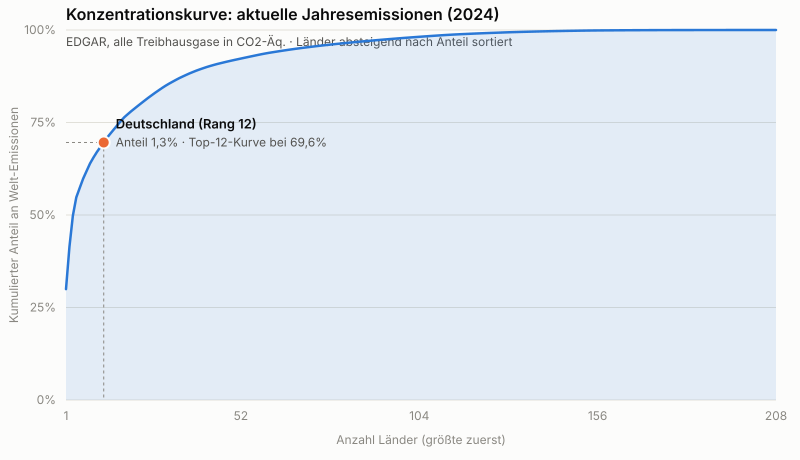
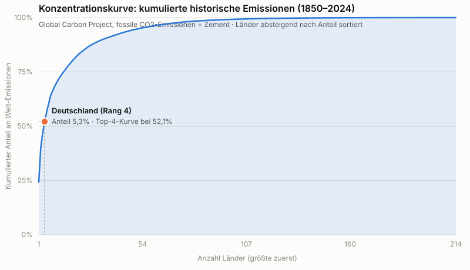

**ENTWURF - nicht veroeffentlicht. Freigabe durch Daniel Saure erforderlich vor Publikation.**

---

# Die Trittbrettfahrer-Rechnung: Was, wenn "zu klein, um zu zählen" für alle gelten würde?

## Einleitung

In der deutschen Klimadebatte taucht immer wieder ein bestimmtes
Argumentmuster auf, mit dem deutsche Klimaschutzmaßnahmen als wirkungslos
oder unnötig dargestellt werden: Deutschlands Emissionsanteil an den
weltweiten Emissionen sei ohnehin zu klein, um für die globale Klimabilanz
relevant zu sein. Diese Analyse bewertet nicht, wer dieses Argument wie oft
oder in welchem Kontext vorbringt – dazu wurden keine Daten erhoben, und es
werden keine Personen, Parteien oder Organisationen benannt. Sie stellt
stattdessen ein reines Gedankenexperiment durch: **Wenn** alle Länder mit
einem Emissionsanteil, der kleiner oder gleich dem Deutschlands ist, nach
derselben Logik argumentieren **würden** – welcher Anteil der weltweiten
Emissionen wäre dann gemeinsam "zu klein, um zu zählen"?

Es handelt sich um eine rein deskriptive Aggregationsrechnung, keine
Bewertung von Klimapolitik, Ambition oder historischer/moralischer
Verantwortung. (Methodik, Quellen und Validierung: siehe Kasten am Ende
des Textes – hier geht es erstmal um die Zahlen und das Bild.)

## Die Kernzahl(en)

Die Rechnung wird für zwei Zeithorizonte getrennt durchgeführt – beide sind
gleichrangig, keiner ersetzt den anderen:

- **Aktuelle Jahresemissionen (2024, alle Treibhausgase, EDGAR-Datenbank):**
  Deutschlands Anteil an den weltweiten Emissionen liegt bei **1,3 %** (Rang
  12 von 208 erfassten Ländern). Alle Länder mit einem Anteil kleiner oder
  gleich diesem Wert kommen zusammen auf **31,7 %** der weltweiten
  Jahresemissionen.
- **Kumulierte historische Emissionen (1850–2024, fossile CO2-Emissionen +
  Zementproduktion, Global Carbon Project):** Deutschlands historischer
  Anteil liegt bei **5,3 %** (Rang 4 von 214 Ländern). Alle Länder mit einem
  historischen Anteil kleiner oder gleich diesem Wert kommen zusammen auf
  **53,1 %** der kumulierten historischen Emissionen seit 1850.

**Wichtiger Hinweis zur Vergleichbarkeit:** Diese beiden Zahlen (31,7 % und
53,1 %) sind nicht direkt wertgleich vergleichbar. Sie beruhen auf
unterschiedlichen Gasbasen (Treibhausgase gesamt in CO2-Äquivalenten vs.
reines CO2 aus fossilen Quellen und Zement) und unterschiedlichen
Zeithorizonten (ein Jahr vs. 175 Jahre Kumulation). Beide werden hier
bewusst nebeneinander berichtet, keine der beiden Zahlen ist "die"
Kernzahl der Analyse.

## Der eigentliche Hauptbefund: die Konzentrationskurve

Die eigentliche Hauptaussage dieser Analyse ist **nicht** eine einzelne
Prozentzahl, sondern die vollständige Konzentrationskurve: alle Länder
absteigend nach Emissionsanteil sortiert, mit dem kumulierten Anteil auf
der y-Achse. Deutschlands Position ist darin markiert, aber nicht
methodisch privilegiert – die Wahl gerade dieser Schwelle ergibt sich
allein aus dem Bezug auf ein in der öffentlichen Debatte diskutiertes
Land, nicht aus einem statistischen Kriterium.

Wie empfindlich das Ergebnis von der genauen Position auf dieser Kurve
abhängt, zeigt die vorab festgelegte Rangplatz-Sensitivität. Für die
aktuellen Jahresemissionen (2024) verändert sich der kumulierte Anteil der
größten Emittenten bis zu einem bestimmten Rang so:

| Position (Rang) | Kumulierter Anteil größter Emittenten |
|---|---|
| DE−20 (Rang 1) | 30,0 % |
| DE−10 (Rang 2) | 41,4 % |
| DE (Rang 12) | 69,6 % |
| DE+10 (Rang 22) | 79,5 % |
| DE+20 (Rang 32) | 86,0 % |

Für die kumulierte historische Betrachtung (1850–2024):

| Position (Rang) | Kumulierter Anteil größter Emittenten |
|---|---|
| DE−20 (Rang 1) | 24,2 % |
| DE−10 (Rang 1) | 24,2 % |
| DE (Rang 4) | 52,1 % |
| DE+10 (Rang 14) | 75,4 % |
| DE+20 (Rang 24) | 85,1 % |

Schon eine Verschiebung um wenige Ränge verändert diesen kumulierten Wert
deutlich – das Bild "die kleinen Länder summieren sich auf X %" ist also
kein festes Ergebnis, sondern hängt sichtbar davon ab, wo genau man die
Grenze zieht.

## Einordnung: Pro-Kopf-Stratifizierung

Um eine unangemessene Vermischung mit einkommensschwachen Ländern zu
vermeiden, wurde dieselbe Rechnung zusätzlich auf die Teilmenge der Länder
beschränkt, deren Pro-Kopf-Ausstoß über dem globalen Durchschnitt liegt.
Deutschlands Pro-Kopf-Ausstoß (8,07 t CO2-Äq/Kopf, 2024) liegt über dem
globalen Durchschnitt (6,36 t CO2-Äq/Kopf) – die Voraussetzung für diese
Stratifizierung ist damit erfüllt. Innerhalb dieser 58 Länder (von
ursprünglich 195 mit verfügbarem Pro-Kopf-Wert) liegt Deutschland auf Rang
8; alle Länder dieser Teilmenge mit einem Anteil kleiner oder gleich dem
Deutschlands kommen auf 21,0 % der Emissionen dieser Teilmenge bzw. 14,2 %
der weltweiten Gesamtemissionen. Mit dem globalen Median statt Mittelwert
als Schwelle (Sensitivität) ergibt sich stattdessen 27,0 % innerhalb einer
größeren Teilmenge von 97 Ländern.

**Was diese Zahlen nicht bedeuten:** Diese Analyse trifft keine Aussage
über historische oder moralische Verantwortung, über Pro-Kopf-Fairness
insgesamt oder darüber, welches Land "mehr schuld" an der Klimakrise
trägt. Es ist eine rein deskriptive Anteilsrechnung. Ebenso wenig wird
bewertet, ob ein niedriger oder hoher Emissionsanteil auf Klimapolitik,
Wirtschaftsstruktur, Bevölkerungszahl oder Zufall der Ländergrenzen
zurückgeht. Und: Alle produktionsbasierten Zahlen (EDGAR, GCP) zählen
Emissionen dort, wo sie physisch entstehen – nicht dort, wo die daraus
resultierenden Güter konsumiert werden. Für Länder mit hohem Nettoimport
emissionsintensiver Güter kann die konsumbasierte Zahl spürbar höher
liegen (siehe Sensitivität unten); die produktionsbasierte Kernzahl
beschreibt ausschließlich territoriale Emissionsanteile, nicht
"tatsächliche Klimaverantwortung".

**Abgrenzung:** Diese Analyse ist keine Fortführung und kein Ersatz für die
separate Analyse `Analysen/2026-08-emissionen/SAP_DE-Emissionen-Trendprojektion-2040.md`,
die eine völlig andere Frage behandelt: wie sich Deutschlands **eigene**
Emissionen zeitlich in die Zukunft entwickeln (Trendprojektion bis 2040
gegen das gesetzliche Minderungsziel). Die vorliegende Rechnung ist dagegen
eine Querschnitts-Aggregation über viele Länder zu einem Zeitpunkt bzw.
kumuliert über die Historie – keine Projektion, keine Aussage über
Deutschlands zukünftige Entwicklung.

## Methodik-Box

- **Quellen (Primär):** EDGAR (Emissions Database for Global Atmospheric
  Research, EU JRC) für aktuelle Jahresemissionen 2024, alle Treibhausgase
  in CO2-Äquivalenten, 208 Länder; Global Carbon Project / Global Carbon
  Budget für kumulierte territoriale fossile CO2-Emissionen (inkl. Zement)
  1850–2024, 214 Länder; Weltbank (World Development Indicators) für
  Bevölkerungsdaten 2024 (Nenner der Pro-Kopf-Berechnung). Zugriffsdatum
  aller Rohdaten: 31.08.2026.
- **Sekundärquelle:** Our World in Data (OWID), ausschließlich zur
  Kreuzprüfung des EDGAR-Ausgangswerts (Abweichung: 0,089 Prozentpunkte)
  sowie für die konsumbasierte Sensitivitätsanalyse (SAP-Wortlaut).
- **Definition der Kernzahl:** Summe der Emissionsanteile aller Länder mit
  einem Anteil kleiner oder gleich Deutschlands Anteil (Deutschland
  eingeschlossen), getrennt für aktuelle Jahresemissionen und kumulierte
  historische Emissionen.
- **Sensitivitätsanalysen (alle vorab im SAP festgelegt, vollständig
  berichtet, keine nachträgliche Auswahl):**
  - CO2-only statt Treibhausgase gesamt (aktuelles Jahr): DE-Anteil 1,5 %,
    Kernzahl 30,1 % (Primärvariante 2a: 31,7 %).
  - Konsumbasiert statt produktionsbasiert (OWID, Jahr 2023, nur CO2):
    DE-Anteil 2,1 %, Kernzahl 40,5 %. Nicht direkt vergleichbar mit 2a
    (andere Gasbasis, anderes Jahr).
  - Zusätzlich Landnutzungsänderungs-Emissionen (Mittel dreier GCP-Modelle,
    historisch kumuliert): DE-Anteil 3,5 %, Kernzahl 54,0 % (Primärvariante
    2b: 53,1 %) – höhere Modellunsicherheit dieser Teilkomponente zu
    beachten.
  - Rangplatz-Sensitivität: siehe Tabellen oben.
- **Kein statistisches Inferenzverfahren:** Es werden keine p-Werte, keine
  Konfidenzintervalle im klassischen Sinn berechnet – die Analyse ist
  deterministisch-deskriptiv (nahezu vollständige Länderabdeckung statt
  Stichprobe). Robustheit wird stattdessen über die oben genannten
  Sensitivitätsanalysen gezeigt.
- **Validierung:** Unabhängige statistische Prüfung gemäß Projekt-Workflow.
  Erstprüfung fand einen kritischen Fehler in einem Datenkonverter (führte
  zu einem falschen Zwischenwert für die historische Kernzahl); nach
  Behebung wurden alle Kernzahlen unabhängig neu berechnet und bestätigt.
  Finale Freigabe: 31.08.2026 (`Validierungsbericht_Nachkontrolle.md`).
- **Vollständige Reproduzierbarkeit:** SAP, R-Skript, Rohdaten-Aufbereitungslog,
  alle Output-Tabellen und -Grafiken sowie beide Validierungsberichte liegen
  offen im Analyseordner:
  `Analysen/2026-08-trittbrettfahrer-rechnung/`.

## Link zum Repo

[Link zum GitHub-Repository klima-evidenzcheck – vor Veröffentlichung durch
Daniel Saure einzusetzen]

Analyseordner (Repo-intern): `Analysen/2026-08-trittbrettfahrer-rechnung/`
