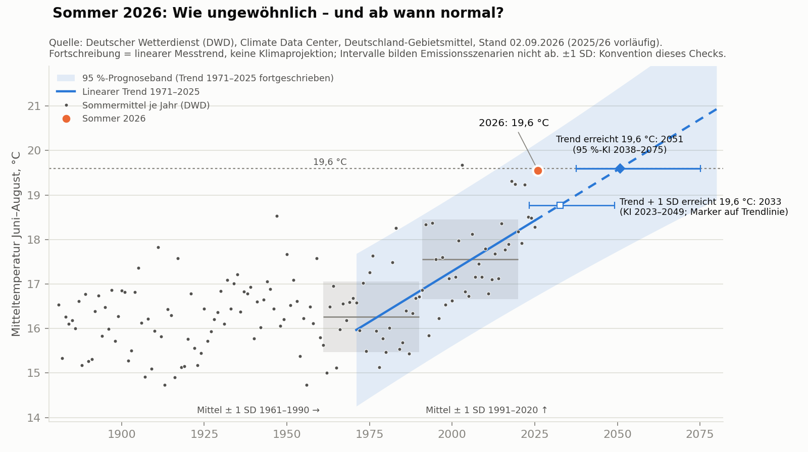

**FREIGEGEBEN durch Daniel Saure am 11.09.2026 (im Chat: „Freigabe erteilt“) – noch nicht veröffentlicht. Vor Veröffentlichung: DWD-Originaldatei in `rohdaten/` ablegen (Validierungsauflage 9), Analyseordner nach GitHub pushen.** Kontaktzeile am Ende: Entscheidung Daniel 11.09.2026 (drin, mit E-Mail).

---

# War der Sommer 2026 „ganz normal“? Es kommt darauf an, womit man vergleicht

## Einleitung

In der politischen Debatte der vergangenen Wochen wurde der Sommer 2026 als „ganz normal“ bezeichnet. Tobias Fuchs, beim DWD Leiter des Geschäftsbereichs Klima und Umwelt, sagte im [Interview mit klimareporter°](https://klimareporter.de/erdsystem/in-30-jahren-koennte-dieser-sommer-normal-sein) (08.09.2026), vor 30 oder 40 Jahren wäre ein solcher Sommer „extrem ungewöhnlich“ gewesen. Und weiter: „Wenn wir in 30 Jahren zurückblicken, könnte es allerdings sein, dass wir ihn eher als normal betrachten.“

Beide Aussagen drehen sich um das Wort „normal“ – und das lässt sich ohne Vergleichsmaßstab nicht prüfen. Wir haben deshalb vorab festgelegt, womit wir vergleichen, und mit der DWD-Temperaturreihe seit 1881 nachgerechnet.

## Die Ergebnisse auf einen Blick

- Mit 19,6 °C im Mittel von Juni bis August war 2026 der zweitwärmste Sommer seit 1881.
- **Verglichen mit 1961–1990:** 3,3 Grad wärmer – wärmer als jeder Sommer dieser 30 Jahre.
- **Verglichen mit dem aktuellen Klimanormal 1991–2020:** 2,0 Grad wärmer – nur 2003 war wärmer.
- **Verglichen mit dem Erwärmungstrend seit 1971:** 1,1 Grad über dem erwarteten Wert. So weit über dem Trend lag seit 1971 etwa jeder siebte Sommer.
- **Wenn der bisherige Trend linear anhält,** wäre ein Sommer wie 2026 um das Jahr 2051 ein typischer Sommer (95-%-Intervall 2038–2075) und schon ab etwa 2033 nicht mehr ungewöhnlich (2023–2049).

## Wie ungewöhnlich war 2026?

Für jeden Vergleichsmaßstab haben wir berechnet, wie weit 2026 vom jeweiligen Normalwert entfernt lag – gemessen in Standardabweichungen, also in der typischen Schwankung von Sommer zu Sommer. Die Einstufung ist eine Konvention, die wir vor der Auswertung festgelegt haben: bis 1 Standardabweichung „im Normalbereich“, bis 2 „ungewöhnlich warm“, bis 3 „außergewöhnlich warm“, darüber „extrem außergewöhnlich“.

| Vergleich mit | Normalwert | Abstand | Einstufung |
|---|---|---|---|
| Klima 1961–1990 | 16,3 °C | +3,3 Grad (4,1 SD) | extrem außergewöhnlich |
| Klima 1991–2020 | 17,6 °C | +2,0 Grad (2,2 SD) | außergewöhnlich warm |
| Trend 1971–2025 | 18,5 °C | +1,1 Grad (1,3 SD) | ungewöhnlich warm |

Gemessen an 1961–1990 war 2026 nach unserer Konvention also „extrem außergewöhnlich“ – das passt zur Einschätzung von Tobias Fuchs. Gemessen am bereits erwärmten Klima von heute fällt die Abweichung kleiner aus: 8 der 55 Sommer seit 1971 lagen mindestens so weit über dem Trend. Nach einer alternativen, auf Perzentilen beruhenden Betrachtung liegt 2026 sogar knapp noch im oberen Normalbereich – allerdings nur 0,09 Grad unter der Grenze, in der Größenordnung möglicher Nachkorrekturen des vorläufigen Werts.

„Ganz normal“ lässt sich der Sommer gemessen an 1961–1990 und 1991–2020 nicht nennen. Gemessen am heutigen Trend war er ein warmer Sommer, wie er seit 1971 etwa jedes siebte Jahr vorkam.

## Ab wann wäre so ein Sommer „normal“?

Seit 1971 sind die Sommer in Deutschland im Mittel um knapp 0,5 Grad pro Jahrzehnt wärmer geworden (95-%-Intervall 0,3–0,6). Schreibt man diesen Trend linear fort, ergibt sich:

- Um **2051** läge der erwartete Sommer bei 19,6 °C – ein Sommer wie 2026 wäre dann typisch (95-%-Intervall 2038–2075).
- Schon ab etwa **2033** wäre er nach unserer Konvention nicht mehr ungewöhnlich, also höchstens eine Standardabweichung über dem Trend (95-%-Intervall 2023–2049).

Die Aussage „in 30 Jahren“ – also um 2056 – liegt im Intervall für den typischen Sommer. Sie steht damit nicht im Widerspruch zum Messtrend. Mit anderen Trendzeiträumen und Modellen verschiebt sich das Jahr des typischen Sommers zwischen 2045 und 2058; die obere Intervallgrenze reicht je nach Zeitraum bis 2112.

Wichtig: Das ist eine statistische Fortschreibung der Messwerte, **keine Klimaprojektion**. Wie warm die Sommer tatsächlich werden, hängt davon ab, wie sich die weltweiten Emissionen entwickeln. Diese Unsicherheit steckt in unseren Intervallen nicht. Fuchs' weitere Aussage, ein Sommer wie 2026 könne in der zweiten Jahrhunderthälfte „sogar als kühl gelten“, haben wir deshalb bewusst nicht geprüft.

## Was diese Analyse nicht sagt

Wir haben nur die Mitteltemperatur von Juni bis August betrachtet – nicht Hitzewellen, Höchstwerte, Tropennächte oder Trockenheit. Die Analyse sagt nichts darüber, warum der Sommer so warm war, und bewertet weder Personen noch Parteien oder Klimapolitik.

## Methodik-Box

- **Daten:** Deutscher Wetterdienst, Climate Data Center, Gebietsmittel Deutschland, Sommer (Juni–August) 1881–2026, Stand 02.09.2026; Werte 2025 und 2026 vorläufig.
- **Vergleiche:** Mittelwert und Standardabweichung der Klimanormalperioden 1961–1990 und 1991–2020; lineare Regression 1971–2025 mit 95-%-Prognoseintervall für 2026.
- **Trendfortschreibung:** Jahr, in dem der Trend 19,6 °C erreicht, mit Konfidenzintervall nach Fieller; Sensitivitätsanalysen (andere Zeiträume, 2026 im Modell, Bruchpunkt-Modell ab 1881 – frühe Werte weniger vergleichbar –, ARIMA, Perzentil-Definition, Bootstrap).
- **Vorgehen:** Analyseplan vor Sichtung der Daten festgelegt; Abweichungen protokolliert; Kernzahlen unabhängig validiert.
- **Grenzen:** Referenzperioden mit je 30 Jahren; Trendabweichungen nicht normalverteilt (daher Häufigkeit und Perzentile ergänzt); Deutschland-Mittel verdeckt regionale Unterschiede; Extrapolation über drei Jahrzehnte.

## Quellen

- **Deutscher Wetterdienst**, Climate Data Center, Gebietsmittel Lufttemperatur Sommer: [opendata.dwd.de](https://opendata.dwd.de/climate_environment/CDC/regional_averages_DE/seasonal/air_temperature_mean/regional_averages_tm_summer.txt)
- **klimareporter°**, Interview mit Tobias Fuchs (DWD), 08.09.2026: [„In 30 Jahren könnte dieser Sommer normal sein“](https://klimareporter.de/erdsystem/in-30-jahren-koennte-dieser-sommer-normal-sein)

## Mehr erfahren

Analyseplan, Code, alle Tabellen und der vollständige Validierungsbericht: [github.com/dsaure55/klima-evidenzcheck/.../2026-09-sommer-2026-normal](https://github.com/dsaure55/klima-evidenzcheck/tree/main/Analysen/2026-09-sommer-2026-normal)

*Ihr habt eine Frage zu öffentlichen Klimadaten, die ihr so geprüft haben wollt? Schreibt uns: [dsaure55@gmail.com](mailto:dsaure55@gmail.com)*
